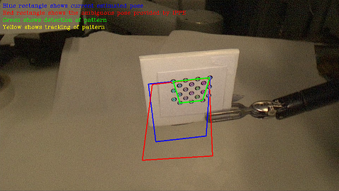
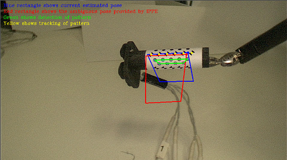

# Hybrid Marker Tracker #

## Intro ##
This is the C++ implementation of the paper: [L. Zhang, M. Ye, C. Chan, G.-Z. Yang, "Real-Time Surgical Tool Tracking and Pose Estimation using a Hybrid Cylindrical Marker" IJCARS. 2017.](http://rdcu.be/ql1V). 
We hope you find the tracker useful and if so please cite the paper:
> @Article{Zhang2017,
> author="Zhang, Lin and Ye, Menglong and Chan, Po-Ling and Yang, Guang-Zhong",
> title="Real-time surgical tool tracking and pose estimation using a hybrid cylindrical marker",
> journal="International Journal of Computer Assisted Radiology and Surgery",
> year="2017",
> pages="1--10",
> issn="1861-6429",
> doi="10.1007/s11548-017-1558-9",
> url="http://dx.doi.org/10.1007/s11548-017-1558-9"
> }

Two types of marker can be tracked:
- Planar circular-dot marker use `TrackerKeydot` class
- Cylindrical hybrid marker use `TrackerCurvedot` class

## Dependencies ##
- \> OpenCV 3.0 (should work with 2.4 but not tested)
- CMake (for project configuration)

## How To Run ##
1. Under the root directory of the repository (i.e. where this README located), create a folder called `build`.
2. In CMake, direct the source code to this root directory, and the binaries to the `build` directory. Then press configure then generate in CMake.
3. Download test videos from:
> https://d.pr/XDO5O (planar circular-dot)
> https://d.pr/r9DAp (cylindrical hybrid)

4. In `src/main.cpp`, modify the video directory to where the videos was downloaded.
5. In `config/Settings.xml`, modify tag `patternToUse` to either `CIRCULAR` or `HYBRID` depending on the marker you are using.
6. Build & run the code.

## Print Your Own Marker ##
The marker design is saved in `config/curve_pattern.svg` which can be edited by [Inkscape](https://inkscape.org/en/download/). We recommend you use Inkscape to print the marker.
Before printing, check `File-Document Properties` and set `Page Size` to **A4**, `Units` to **mm**.

You should also modify options in `config/Settings.xml` accordingly.

## Licence ##
This project is licensed under the BSD License - see the [LICENCE](LICENCE) file for details.
IPPE, which is used in this project, is BSD licence. 
